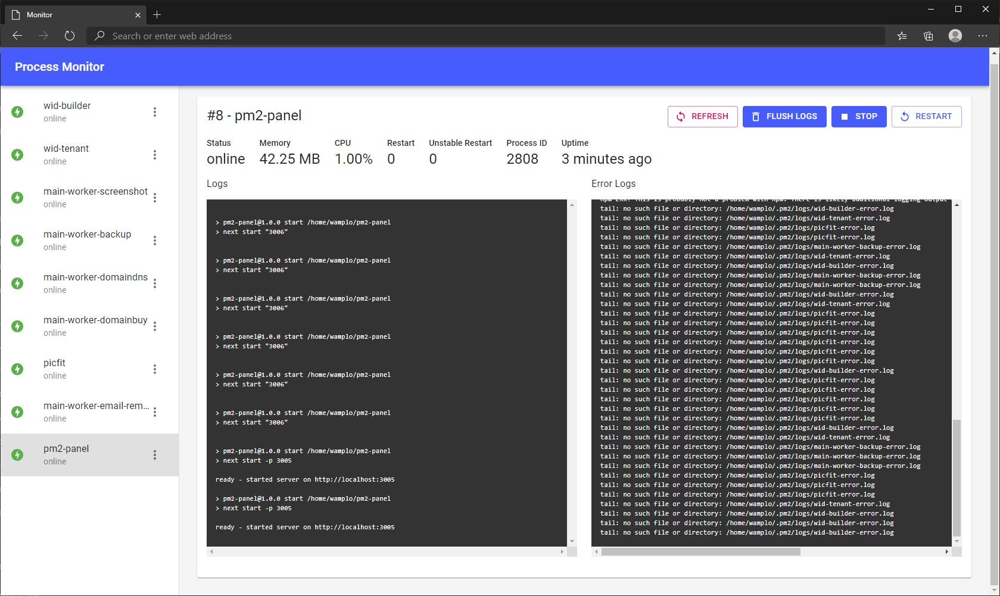

# pm2 panel

Simple pm2 management panel made with [next.js](https://github.com/vercel/next.js)



## Installation

Clone this repository and build the package

```
git clone https://github.com/pedox/pm2-panel
yarn build
```

To start application run this command, and application will served at http://localhost:3000

```
yarn start
```
